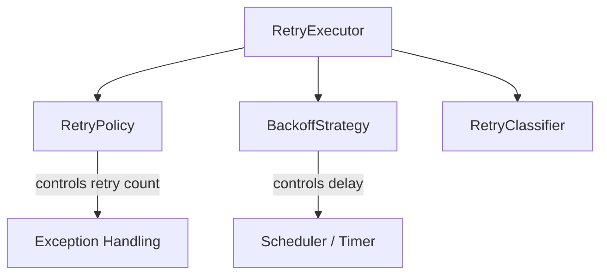

# retrylib

> Lightweight, dependency-free Java 17 library for resilient async operations — featuring configurable retry policies, pluggable backoff strategies, and flexible fallback execution.

---

## 🚀 Overview

**retrylib** provides a simple, composable retry framework for Java applications.  
It helps you handle transient failures with configurable retry rules, backoff strategies, and classification — all designed to be **async**, **thread-safe**, and **zero-dependency**.

---

## ⚙️ Features

- ⏱️  Built-in **Fixed**, **Exponential**, and **Jittered** backoff strategies  
- 🧩  Fluent **RetryPolicyBuilder** for max attempts and retry classification  
- 🧠  **RetryClassifier** interface for tagging retryable exceptions  
- 🧵  **Async retry executor** with `CompletableFuture` support  
- 🪶  **Zero dependencies**, built purely with Java 17  
- 💡  Fully extensible — plug in your own strategies, classifiers, or executors  

---

## 💡 Example Usage

### 🔁 Async Retry Without Fallback
```java
import com.github.cf06yash.core.backoff.strategy.BackoffStrategy;
import com.github.cf06yash.core.backoff.strategy.impl.JitterBackoffStrategy;
import com.github.cf06yash.core.retry.executor.RetryExecutorBuilder;
import com.github.cf06yash.core.retry.policy.RetryPolicy;
import com.github.cf06yash.core.retry.policy.RetryPolicyBuilder;
import com.github.cf06yash.core.retry.tagging.impl.DefaultRetryClassifier;
import com.github.cf06yash.retrylib.example.utils.TaskUtils;

import java.util.concurrent.Executors;
import java.util.logging.Logger;

public class AsyncExample {

    private static final Logger log = Logger.getLogger(Logger.GLOBAL_LOGGER_NAME);

    public void noFallbackExample() {
        RetryPolicy retryPolicy = RetryPolicyBuilder.newBuilder()
                .classifier(DefaultRetryClassifier.INSTANCE)
                .maxAttempts(2)
                .build();

        BackoffStrategy backoffStrategy = JitterBackoffStrategy.withMinMaxDelay(1000, 3000);

        var executor = RetryExecutorBuilder.newBuilder()
                .backoffStrategy(backoffStrategy)
                .retryPolicy(retryPolicy)
                .scheduler(Executors.newScheduledThreadPool(1))
                .buildAsync();

        var future = executor.executeAsync(TaskUtils.getSupplierTaskWithException());
        future.whenComplete((res, ex) -> {
            log.info("Response (no fallback): " + res);
            log.info("Error (no fallback): " + (ex != null ? ex.getMessage() : "none"));
        });
    }
}
````

---

### 🧩 Async Retry With Fallback

```java
var executor = RetryExecutorBuilder.newBuilder()
        .backoffStrategy(JitterBackoffStrategy.withMinMaxDelay(1000, 3000))
        .retryPolicy(RetryPolicyBuilder.newBuilder()
                .classifier(DefaultRetryClassifier.INSTANCE)
                .maxAttempts(2)
                .build())
        .scheduler(Executors.newScheduledThreadPool(1))
        .buildAsync();

var future = executor.executeAsyncWithFallback(
        TaskUtils.getSupplierTaskWithException(),
        TaskUtils.getSupplierTask("Fallback result")
);

future.whenComplete((res, ex) -> {
    log.info("Response (fallback): " + res);
    log.info("Error (fallback): " + (ex != null ? ex.getMessage() : "none"));
});
```

---

## 🧠 Architecture Overview



**Key Components**

| Component         | Description                                        |
| ----------------- | -------------------------------------------------- |
| `RetryExecutor`   | Executes async tasks with retry and fallback logic |
| `RetryPolicy`     | Controls retry attempts and limits                 |
| `BackoffStrategy` | Determines delay between retries                   |
| `RetryClassifier` | Defines which exceptions are retryable             |

---

## 🧩 Built-in Strategies

| Strategy                       | Description                                  |
| ------------------------------ | -------------------------------------------- |
| **FixedBackoffStrategy**       | Constant delay between retries               |
| **ExponentialBackoffStrategy** | Delay doubles each attempt, capped at 1 hour |
| **JitterBackoffStrategy**      | Random delay between min and max bounds      |

---

## 🧾 Requirements

* **Java 17+**
* **No external dependencies**

---

## 🧪 Running Tests

```bash
mvn clean test
```

All components are covered with JUnit 5 tests — including concurrent tests for thread-safety.

---

## 📦 Modules

| Module             | Description                                                      |
| ------------------ | ---------------------------------------------------------------- |
| `retrylib-core`    | Core library (strategies, classifiers, policy builder, executor) |
| `retrylib-example` | Sample usage and demonstration code                              |

---

## 🧱 Design Principles

* **No dependencies** — pure Java
* **Thread-safe** execution primitives
* **Composable architecture**
* **Fluent API** for configuration
* **Extensible** — plug in your own policies or backoff strategies

---

## 📄 License

MIT License © 2025 [Yash Sharma](https://github.com/cf06yash)

```

---

Would you like me to include a small “💡 Motivation” or “Use Cases” section next (e.g., “Retrying transient network failures, I/O operations, or database calls”)?  
That adds context if you’re planning to make the repo public or open source.
```
