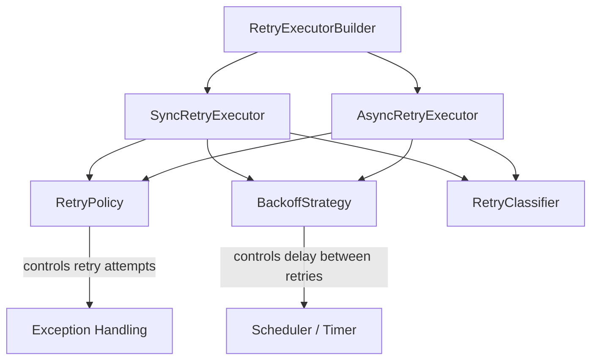

# retrylib

> Lightweight, dependency-free Java 17 library for resilient **synchronous** and **asynchronous** retry execution — featuring configurable retry policies, pluggable backoff strategies, and flexible fallback handling.

---

## 🚀 Overview

**retrylib** provides a simple and extensible framework for handling transient failures in Java applications.
It supports both **sync** and **async** retry execution models — allowing you to easily combine **retry policies**, **backoff strategies**, and **exception classifiers** to make your code more resilient.

All components are **thread-safe**, **modular**, and built using **pure Java 17**, with **no external dependencies**.

---

## ⚙️ Features

* 🔁 **Sync & Async Retry Executors** – choose between blocking or non-blocking style
* ⏱️ Built-in **Fixed**, **Exponential**, and **Jittered** backoff strategies
* 🧹 Fluent **RetryPolicyBuilder** for flexible retry configuration
* 🧠 **RetryClassifier** for marking retryable exceptions
* 🩶 **Zero dependencies**, pure Java
* 💡 **Extensible** architecture — plug in your own policy, strategy, or executor

---

## 💡 Synchronous Retry Examples

```java
package com.github.cf06yash.retrylib.example;

import com.github.cf06yash.core.backoff.strategy.BackoffStrategy;
import com.github.cf06yash.core.backoff.strategy.impl.ExponentialBackoffStrategy;
import com.github.cf06yash.core.backoff.strategy.impl.FixedBackoffStrategy;
import com.github.cf06yash.core.backoff.strategy.impl.JitterBackoffStrategy;
import com.github.cf06yash.core.retry.executor.RetryExecutorBuilder;
import com.github.cf06yash.core.retry.policy.RetryPolicy;
import com.github.cf06yash.core.retry.policy.RetryPolicyBuilder;
import com.github.cf06yash.core.retry.policy.impl.DefaultRetryPolicy;
import com.github.cf06yash.core.retry.tagging.impl.DefaultRetryClassifier;
import com.github.cf06yash.retrylib.example.utils.TaskUtils;

import java.util.logging.Logger;

public class SyncExample {

    private static final Logger log = Logger.getLogger(Logger.GLOBAL_LOGGER_NAME);

    public void exponentialExample() {
        RetryPolicy retryPolicy = DefaultRetryPolicy.withMaxAttempts(3);
        BackoffStrategy backoffStrategy = ExponentialBackoffStrategy.withBaseDelayMillis(1000);
        var executor = RetryExecutorBuilder.newBuilder()
                .backoffStrategy(backoffStrategy)
                .retryPolicy(retryPolicy)
                .build();
        try {
            executor.execute(TaskUtils.getTaskWithException());
        } catch (Exception e) {
            log.info("Error in processing task");
        }
    }

    public void fixedDelayExample() {
        RetryPolicy retryPolicy = DefaultRetryPolicy.withMaxAttempts(3);
        BackoffStrategy backoffStrategy = FixedBackoffStrategy.withDelayMillis(1000);
        var executor = RetryExecutorBuilder.newBuilder()
                .backoffStrategy(backoffStrategy)
                .retryPolicy(retryPolicy)
                .build();
        try {
            executor.execute(TaskUtils.getTaskWithException());
        } catch (Exception e) {
            log.info("Error in processing task");
        }
    }

    public void jitterDelayExample() {
        RetryPolicy retryPolicy = RetryPolicyBuilder.newBuilder()
                .classifier(DefaultRetryClassifier.INSTANCE)
                .maxAttempts(6)
                .build();
        BackoffStrategy backoffStrategy = JitterBackoffStrategy.withMinMaxDelay(1000, 10000);
        var executor = RetryExecutorBuilder.newBuilder()
                .backoffStrategy(backoffStrategy)
                .retryPolicy(retryPolicy)
                .build();
        try {
            executor.execute(TaskUtils.getTaskWithException());
        } catch (Exception e) {
            log.info("Error in processing task");
        }
    }
}
```

---

## ⚙️ Asynchronous Retry Examples

```java
package com.github.cf06yash.retrylib.example;

import com.github.cf06yash.core.backoff.strategy.BackoffStrategy;
import com.github.cf06yash.core.backoff.strategy.impl.JitterBackoffStrategy;
import com.github.cf06yash.core.retry.executor.RetryExecutorBuilder;
import com.github.cf06yash.core.retry.policy.RetryPolicy;
import com.github.cf06yash.core.retry.policy.RetryPolicyBuilder;
import com.github.cf06yash.core.retry.tagging.impl.DefaultRetryClassifier;
import com.github.cf06yash.retrylib.example.utils.TaskUtils;

import java.util.concurrent.Executors;
import java.util.concurrent.ScheduledExecutorService;
import java.util.logging.Logger;

public class AsyncExample {

    private static final Logger log = Logger.getLogger(Logger.GLOBAL_LOGGER_NAME);
    private final ScheduledExecutorService scheduler = Executors.newScheduledThreadPool(1);

    public void noFallbackExample() {
        RetryPolicy retryPolicy = RetryPolicyBuilder.newBuilder()
                .classifier(DefaultRetryClassifier.INSTANCE)
                .maxAttempts(2)
                .build();

        BackoffStrategy backoffStrategy = JitterBackoffStrategy.withMinMaxDelay(1000, 3000);

        var executor = RetryExecutorBuilder.newBuilder()
                .backoffStrategy(backoffStrategy)
                .retryPolicy(retryPolicy)
                .scheduler(scheduler)
                .buildAsync();

        var future = executor.executeAsync(TaskUtils.getSupplierTaskWithException());
        future.whenComplete((res, ex) -> {
            log.info("Response (no fallback): " + res);
            log.info("Error (no fallback): " + (ex != null ? ex.getMessage() : "none"));
        });
    }

    public void fallbackExample() {
        RetryPolicy retryPolicy = RetryPolicyBuilder.newBuilder()
                .classifier(DefaultRetryClassifier.INSTANCE)
                .maxAttempts(2)
                .build();

        BackoffStrategy backoffStrategy = JitterBackoffStrategy.withMinMaxDelay(1000, 3000);

        var executor = RetryExecutorBuilder.newBuilder()
                .backoffStrategy(backoffStrategy)
                .retryPolicy(retryPolicy)
                .scheduler(scheduler)
                .buildAsync();

        var future = executor.executeAsyncWithFallback(
                TaskUtils.getSupplierTaskWithException(),
                TaskUtils.getSupplierTask("Fallback task executed successfully")
        );

        future.whenComplete((res, ex) -> {
            log.info("Response (fallback): " + res);
            log.info("Error (fallback): " + (ex != null ? ex.getMessage() : "none"));
        });
    }

    public void fallbackExampleWithRunnable() {
        RetryPolicy retryPolicy = RetryPolicyBuilder.newBuilder()
                .classifier(DefaultRetryClassifier.INSTANCE)
                .maxAttempts(2)
                .build();

        BackoffStrategy backoffStrategy = JitterBackoffStrategy.withMinMaxDelay(1000, 3000);

        var executor = RetryExecutorBuilder.newBuilder()
                .backoffStrategy(backoffStrategy)
                .retryPolicy(retryPolicy)
                .scheduler(scheduler)
                .buildAsync();

        var future = executor.executeAsyncWithFallback(
                TaskUtils.getSupplierTaskWithException(),
                TaskUtils.getRunnableTask("Runnable fallback triggered", log)
        );

        future.whenComplete((res, ex) -> {
            log.info("Response (runnable fallback): " + res);
            log.info("Error (runnable fallback): " + (ex != null ? ex.getMessage() : "none"));
        });
    }
}
```

---

## 🧠 Architecture Overview



| Component            | Description                                                      |
| -------------------- | ---------------------------------------------------------------- |
| `SyncRetryExecutor`  | Executes retry operations synchronously (blocking)               |
| `AsyncRetryExecutor` | Executes retry operations asynchronously via `CompletableFuture` |
| `RetryPolicy`        | Defines maximum attempts and retry conditions                    |
| `BackoffStrategy`    | Determines delay between retry attempts                          |
| `RetryClassifier`    | Identifies retryable exceptions                                  |

---

## 🧹 Built-in Backoff Strategies

| Strategy                       | Description                                              |
| ------------------------------ | -------------------------------------------------------- |
| **FixedBackoffStrategy**       | Constant delay between retries                           |
| **ExponentialBackoffStrategy** | Delay doubles after each attempt, capped at 1 hour       |
| **JitterBackoffStrategy**      | Randomized delay between configurable min and max values |

---

## 🗾 Requirements

* Java 17+
* No external dependencies

---

## 🤮 Running Tests

```bash
mvn clean test
```

---

## 📦 Modules

| Module             | Description                                                 |
| ------------------ | ----------------------------------------------------------- |
| `retrylib-core`    | Core library (strategies, policies, executors, classifiers) |
| `retrylib-example` | Example usage (sync and async demos)                        |

---

## 🧱 Design Principles

* 🩶 **Zero Dependencies** — pure Java 17
* 🔁 **Sync and Async Executors** — choose the model that fits your needs
* 🧹 **Composable** — easily mix and match strategies, classifiers, and policies
* 🧠 **Thread-safe and Stateless** core components
* 👢 **Extensible** — implement your own `BackoffStrategy` or `RetryPolicy`

---

## 📄 License

MIT License © 2025 [Yash Sharma](https://github.com/cf06yash)
